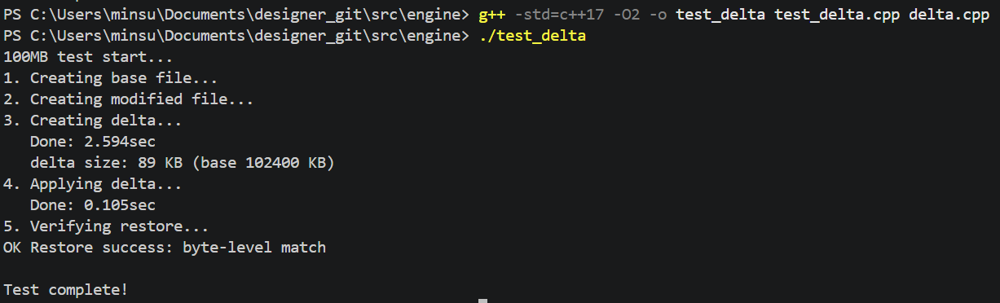
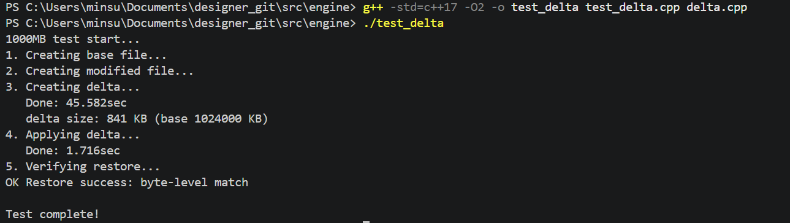
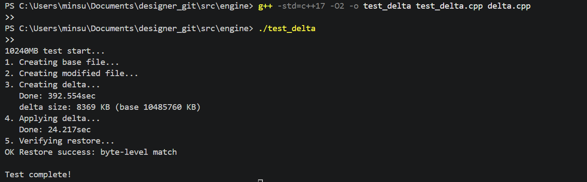

# Delta 엔진 성능 실험 결과

## 실험 환경
- OS: Windows 11
- 컴파일러: g++ 14 (MSYS2 UCRT64)
- 최적화: -O2
- 엔진: CDC 기반 (MIN 4KB / MAX 64KB / 평균 ~16KB)

## 실험 조건
- 파일 내용: 난수(rand()) 데이터
- 수정 방식: 파일 중간 지점 1바이트 XOR 변경
- 반복: 1회 (5/30 벤치마크에서 3회 평균 예정)
- 비교군: Git LFS (전체 파일 재저장)

## 실험 결과 — 파일 크기별 성능

| 파일 크기 | delta 생성 | delta 크기 | 절감률 | 복원 시간 | 복원 정확성 |
|---|---|---|---|---|---|
| 100MB | 3.5초 | 120KB | 99.88% | 0.15초 | ✅ |
| 1GB | 45.3초 | 827KB | 99.92% | 1.4초 | ✅ |
| 10GB | 390초 | 8,372KB | 99.92% | 56.9초 | ✅ |

## 분석

- delta 크기가 파일 크기에 관계없이 99.9% 이상 절감됨
- 처리 시간이 파일 크기에 선형 비례 (1GB × 8.6 ≈ 10GB)
- 복원 정확성 100% (바이트 단위 일치)

## 한계 및 향후 계획

- 현재 싱글스레드 기준 10GB → 390초 소요
- 멀티스레딩 (Producer-Consumer 패턴) 적용 시 개선 예정
- 5/30 실측 벤치마크에서 3회 평균 수치로 확정
- 파일 포맷별 (fbx / exr / tiff) 실험 예정

## 실험 결과 스크린샷

### 100MB

### 1GB

### 10GB
